# Accounts and private network design

## Account placement

| Account | Components | Administrative owner |
|---|---|---|
| Identity/security `111111111111` | Private CA, registration service, Roles Anywhere anchors/profiles, common runner roles, private broker API, entitlement and replay stores | Identity platform and PKI teams |
| Product `222222222222` | Product A job roles, permission boundaries, buckets, keys and application resources | Team A and cloud platform |
| Product `333333333333` | Product B job roles and resources | Team B and cloud platform |
| Log archive | Organization audit logs and immutable broker/enrollment evidence | Security operations |
| Organization management | Account/OU governance only | Organization administrators |

Do not deploy runtime brokers or CA workloads in the Organization management account. The illustrated identity account combines roles for clarity; enterprises may split PKI and broker services into separately governed accounts. Such a split requires explicit CA issuance access and a revised trust-anchor source design.

Maintain exact target-role ARNs in the broker allowlist. A product account trusts specific broker role ARNs and checks the expected `aws:PrincipalOrgID`. This checks the caller's organization, not the target's membership. The registry pipeline separately verifies that each target account is active and belongs to the approved organization/OU. Account removal or suspension disables grants and triggers role-trust removal; do not assume organization membership alone grants or revokes all access.

## Network topology

```mermaid
architecture-beta
  group dc(server)[Datacenter]
  group aws(cloud)[AWS private connectivity]
  group identity(logos:aws-vpc)[Identity services VPC] in aws
  group product(logos:aws-vpc)[Product VPC] in aws

  service nodes(server)[Runner nodes] in dc
  service dns(server)[On premises DNS] in dc
  service dx(internet)[Direct Connect] in aws
  service resolver(logos:aws-route53)[Resolver inbound endpoints] in identity
  service ra(logos:aws-iam)[Roles Anywhere endpoint] in identity
  service api(logos:aws-api-gateway)[Private REST API endpoint] in identity
  service sts(logos:aws-iam)[Regional STS endpoint] in identity
  service ca(logos:aws-certificate-manager)[Private CA endpoint] in identity
  service resources(logos:aws-vpc)[Product endpoints and resources] in product

  nodes:R --> L:dx
  dns:R <--> L:resolver
  dx:R --> L:ra
  dx:R --> L:api
  dx:R --> L:sts
  dx:R --> L:ca
  dx:B --> T:resources
```

Use HTTPS on every hop. Direct Connect is transport, not authentication or an assumption of encryption. Where policy requires link encryption, choose an approved DX encryption arrangement or VPN overlay while retaining application TLS.

## Required paths

| Source | Destination | Purpose | Control |
|---|---|---|---|
| Node agent | Regional Roles Anywhere endpoint, TCP 443 | Obtain common runner session | Endpoint policy, anchor and role trust |
| Node agent | Private broker REST API, TCP 443 | Issue/refresh job credentials | AWS_IAM, endpoint/resource policy, node-bound path, grant validation |
| Node renewal agent | Enrollment HTTPS endpoint | Submit CSR and renew | Authenticated bootstrap/renewal channel and asset registry state |
| On-prem resolver | Resolver inbound endpoints, UDP/TCP 53 | Resolve AWS private names | Conditional forwarding and resolver security groups |
| Broker | Regional STS, registry, replay ledger, audit sink | Authorize and vend credentials | Broker execution role and destination controls |
| Registration service | Private CA API | Sign approved CSRs | Dedicated issuance role, CA/template restrictions |
| CRL importer | CRL storage and Roles Anywhere API | Update imported revocation lists | Dedicated updater role |
| Job | Approved service endpoint or VPC resource | Product operations | Target IAM session plus network/service authorization |

Roles Anywhere's interface endpoint supports private access and endpoint policies.[^ra-endpoint] The selected broker front door is a private API Gateway **REST** API, not an assumption that every API Gateway API type supports private endpoints.[^apigw-private]

Provision endpoints in multiple availability zones. Validate on-prem routes to endpoint ENIs, return paths, security groups, NACLs, MTU, time synchronization and DNS. AWS public API hostnames do not automatically resolve to reachable private IPs from the datacenter. Configure Resolver forwarding and test from each site.

S3 gateway endpoints are not a general on-premises access path over Direct Connect. Select a supported S3 interface endpoint or approved public-service routing where needed. Review private endpoint support per required service and region. Do not put `aws:SourceVpce` conditions on requests whose actual call path lacks that endpoint context.

For the broker, restrict API resource policy to approved VPC endpoint IDs and the runner role; disable alternate unauthenticated methods. Preserve the explicit runner identity-policy denies in [policy examples](../job-authorization/policy-examples.md), since a resource-policy allow must not bypass node-path confinement. Integration invocation is restricted to this API/stage; clients cannot call the broker Lambda directly.

[^ra-endpoint]: [Roles Anywhere interface endpoints](https://docs.aws.amazon.com/rolesanywhere/latest/userguide/vpc-interface-endpoints.html).
[^apigw-private]: [API Gateway private REST APIs](https://docs.aws.amazon.com/apigateway/latest/developerguide/apigateway-private-apis.html).
