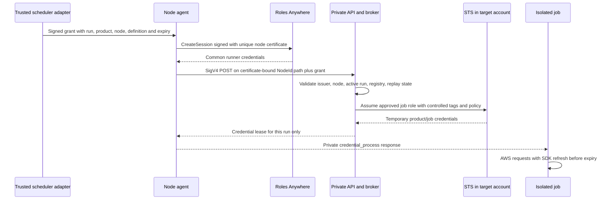
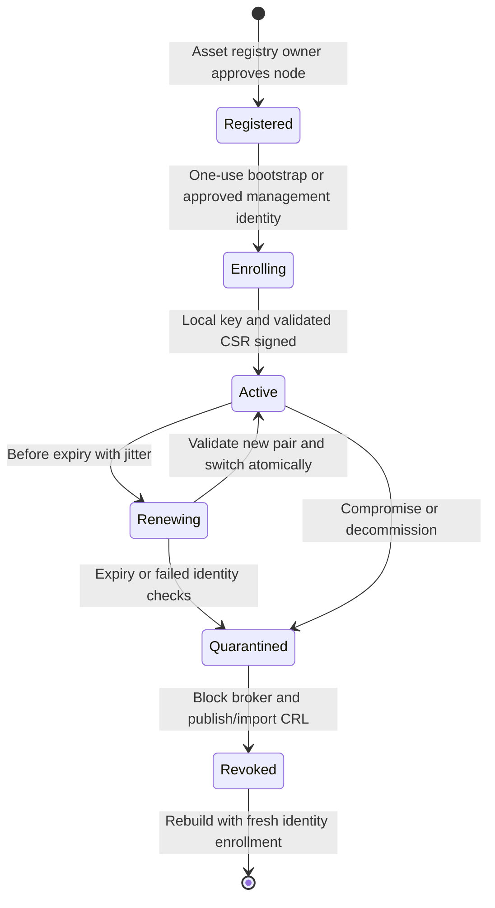

# ADR 001 - Certificate-authenticated runners with job-scoped AWS credentials

**Decision:** use AWS IAM Roles Anywhere to authenticate individual execution nodes into a common runner role. Use a separate credential broker to authorize each scheduled run and assume a narrowly scoped role in the approved product account. Automate node certificate enrollment through an AWS-hosted registration service backed by a centralized AWS Private CA. The configuration-management platform manages the node agent and configuration; private keys are generated locally.

**Status:** proposed for enterprise review. This document is the single consolidated ADR. Its linked bundles contain implementation contracts, examples and acceptance criteria. No cloud resources have been deployed.

## Context and problem

The datacenter can reach corporate AWS VPCs over Direct Connect. The scheduler dispatches product-owned jobs to a pool of interchangeable execution nodes. One node might execute Job A for Product A and Job B for Product B concurrently. Nodes need a common platform role, while each job needs different resource permissions and an auditable product identity.

A unique node certificate solves machine authentication. A shared runner allowed to assume every product role does not solve job authorization: any job able to use that identity could request another product's role, tags or session name. Caller-provided session metadata cannot supply the missing trusted assertion. Network reachability and AWS Organizations membership also do not grant permission.

The selected design separates machine authentication, scheduler attestation, authorization and credential delivery. The broker and scheduler adapter are custom platform services to implement, operate and test.

## Logical architecture

### On-premises server kinds

Classify machines before assigning AWS identities. The [server-kind catalog](../identity-pki/server-kinds.md) covers orchestrators, batch executors, identity and configuration services, application and resource servers, integration gateways, CI runners, Kubernetes control-plane and worker nodes, trusted workload adapters, backup services, telemetry collectors, administration hosts, network appliances and virtualization hosts.

The common runner role applies to approved shared executors and workload adapters. Orchestrators attest work; identity services establish trust; resource servers authorize their own inbound clients; Kubernetes workers host pods with separate workload identities. None of these responsibilities automatically grants product AWS access. Dedicated outbound service integrations require their own scoped service identities, while machines with no AWS API use case need no AWS caller credentials. A server kind is classification metadata, not an entitlement.

### Component topology

```mermaid
architecture-beta
  group dc(server)[Datacenter]
  group node(server)[Shared execution node] in dc
  group identity(cloud)[Identity AWS account]
  group product_a(cloud)[Product A AWS account]
  group product_b(cloud)[Product B AWS account]

  service scheduler(server)[Scheduler] in dc
  service attestor(server)[Scheduler attestor] in dc
  service management(server)[Management and asset registry] in dc
  service agent(server)[Node agent and unique key] in node
  service job_a(server)[Product A job sandbox] in node
  service job_b(server)[Product B job sandbox] in node

  service enrollment(logos:aws-lambda)[Registration service] in identity
  service ca(logos:aws-certificate-manager)[AWS Private CA] in identity
  service ra(logos:aws-iam)[IAM Roles Anywhere] in identity
  service runner(logos:aws-iam)[Common runner role] in identity
  service api(logos:aws-api-gateway)[Private broker API] in identity
  service broker(logos:aws-lambda)[Credential broker] in identity
  service registry(database)[Entitlements and replay ledger] in identity

  service role_a(logos:aws-iam)[Job A role] in product_a
  service data_a(logos:aws-s3)[Product A resources] in product_a
  service role_b(logos:aws-iam)[Job B role] in product_b
  service data_b(logos:aws-s3)[Product B resources] in product_b

  scheduler:B --> T:attestor
  attestor:R --> L:agent
  management:R --> T:agent
  agent:B --> T:job_a
  agent:B --> T:job_b
  agent:R --> L:enrollment
  enrollment:R --> L:ca
  agent:R --> L:ra
  ra:B --> T:runner
  runner:R --> L:api
  api:R --> L:broker
  broker:B --> T:registry
  broker:R --> L:role_a
  broker:R --> L:role_b
  role_a:B --> T:data_a
  role_b:B --> T:data_b
  job_a:R --> L:data_a
  job_b:R --> L:data_b
```

The attestor sends its signed grant through the node agent. The agent uses its certificate for Roles Anywhere, then signs the private API request with the common runner session and includes that grant. The broker uses its separate execution role to assume target roles; the agent delivers only the corresponding target credentials to each sandbox. Role-to-resource edges show permission scope, while job-to-resource edges show data access. All datacenter-to-AWS calls use Direct Connect and TLS. Arrows for the runner role represent authorization, not a network hop. The [diagram guide](diagrams.md) describes AWS icon registration and service-family icon mappings. AWS API access uses private endpoints where available. Roles Anywhere supports interface endpoints; VPC routing alone does not create access to its regional API.[^private]

## Decision details

| Area | Selected design | Reason |
|---|---|---|
| Machine identity | Immutable asset registry NodeId in certificate CN; unique private key per node | Distinguishes equivalent runners and supports individual revocation |
| CA | Central AWS Private CA account, separate production/nonproduction issuing CAs | Central governance with smaller trust domains |
| Enrollment | Local key generation, CSR, registration service with asset registry and bootstrap checks | Avoids distribution of reusable private keys |
| Automation | The configuration-management platform deploys and supervises a renewal agent | Fits managed server fleets and separates config convergence from short renewal intervals |
| Initial AWS role | Common runner role per environment/zone | No role explosion per host; no product permissions |
| Job identity | Short-lived signed scheduler grant bound to node, run, product and definition version | Prevents a job from selecting its own product |
| Authorization | Broker checks authoritative registry and live run lease on every issue/refresh | Central revocation and consistent mapping |
| AWS role granularity | Product/environment/job-permission-class roles in target accounts | Role permissions remain a hard baseline even if optional narrowing is omitted |
| Run restrictions | Broker-generated session policy for approved run prefixes/resources | Supports different inputs and outputs across runs |
| Isolation | Separate job sandbox and credential channel; dedicated compute for hostile trust domains | Prevents adjacent jobs from stealing credentials |
| Kubernetes | Trusted workload adapter, pod-bound identity and namespace controls | A cluster/node certificate alone does not identify a pod |
| Audit | Scheduler, enrollment, broker and AWS events correlated by run ID | Links team ownership, server identity and resource operations |

Roles Anywhere resources used together reside in the same account and region; IAM roles are account-scoped. This architecture places the anchor, profile and initial role in the identity account, then uses normal STS cross-account assumption for product accounts.[^ra-scope]

## Credential flow

The common runner credentials never reach the job. The broker uses its own AWS execution role to call STS; it does not forward the runner credentials into an STS chain. This deliberate boundary means the target session's source identity can identify the run. Node identity is retained in a broker-set tag and the authorization ledger. If a direct runner-to-target chain were used, the initial source identity would persist and could not be replaced with the job identity.[^source]

## Authorization example

Run `r-01abc` of `job-a@sha256:...` belongs to product `product-a`, owned by team `team-a`. It is assigned to `n-0042` and may assume only `arn:aws:iam::222222222222:role/product/product-a/prod/job-a`.

The broker resolves this mapping from an approved registry. It sets `ProductId=product-a`, `JobId=job-a`, `RunId=r-01abc`, `NodeId=n-0042`, and `Environment=prod`; source identity is `run-r-01abc`. The session name is a short readable correlation label. The role permits the `job-a` permission class, and the session policy narrows the run to its approved S3 input/output prefixes. A neighboring product-b job cannot alter its grant to obtain these credentials.

Session policies restrict the role's identity permissions; they do not grant additional permissions. Review resource policies too, especially direct grants to assumed-role sessions, which can undermine an overly simple “intersection of everything” model.[^sessions] Detailed [policy examples](../job-authorization/policy-examples.md) use exact roles and explicit deny controls for resource confinement.

## Certificate lifecycle

Proposed defaults: 24-hour node certificates, renewal at 12 hours with jitter, 15-minute runner credentials, 15-minute job credentials, and two-minute initial scheduler grants. These are design starting points, not AWS defaults or guarantees. STS calls from broker role credentials are role chaining; keep target credentials at or below the one-hour chaining limit and refresh long jobs.[^sessions]

## Alternatives and tradeoffs

| Alternative | Benefits | Costs and failure modes | Decision |
|---|---|---|---|
| Shared node certificate and direct assumption of all product roles | Few components | Any holder can select another product; session names do not enforce ownership | Reject |
| Unique node certificates, shared broad runner role and caller-supplied product tags | Per-node audit | Identifies host but leaves product assertion untrusted | Reject for mixed-product nodes |
| Dedicated product execution pools and product certificates | Simpler authorization, stronger compute separation | Capacity fragmentation and more operations | Supported fallback; preferred for high-assurance products |
| Short-lived certificate per job, bound to product by trusted issuer | Certificate itself carries workload identity; direct Roles Anywhere path possible | Issuance on job hot path, key isolation, per-account anchors or role chains, additional CA load | Future alternative if workload PKI is already mature |
| Central broker with common runner identity | Preserves shared nodes; explicit job authorization and revocation | Custom security-critical software, availability dependency, broker compromise blast radius | Selected |
| Per-account Roles Anywhere anchors with centralized CA public certificate bundles | Removes central initial-role dependency; account-local trust | More profile, anchor and CRL deployments; still needs trustworthy job identity | Optional for product-dedicated workloads |
| Kubernetes OIDC federation | Native pod identity without certificate distribution to each pod | Requires trusted issuer lifecycle and account trust configuration; does not cover generic servers | Consider separately for mature clusters |
| The configuration-management platform distributes pre-generated keys | Easy initial scripting | Central key exposure, cloning and stale secret copies | Reject |
| Static IAM access keys on servers | Broad compatibility | Long-lived secret register and rotation burden | Reject |

## Consequences and residual risks

The CA registration authority controls machine identity. The scheduler controls run identity. The broker controls credential issuance. Compromise of any relevant authority can invalidate the associated assurance. Separate duties, use environment-specific broker roles, and scope target roles to job classes. Add product-specific broker deployments for products needing a smaller compromise domain.

Root on a shared node can steal credentials or misuse the local signer. TPM-backed keys reduce extraction but do not prevent an attacker with signing access from impersonating a running node. Separate VMs or nodes are required where products must withstand malicious host administrators.

Revocation blocks future issuance; already-issued credentials can remain useful until expiry or an effective AWS deny. Cancellation stops refresh but does not make STS credentials disappear. Incident procedures apply node and run deny controls in addition to certificate revocation.

Central services add latency, cost and operational work. Queue jobs during outages; retain already-authorized sessions only within their original expiry. Never fail over to a broad role. A second region requires independently provisioned CA/anchor/profile configuration and a replay strategy, not merely another DNS name.

## Adoption and decision gates

Pilot two products on two shared nodes and one Kubernetes cluster in nonproduction. Prove cross-product denial, node-path binding, replay protection, credential isolation, renewal during long jobs, CRL handling, cancellation and region failure. Production adoption requires the [acceptance matrix](../operations/acceptance-tests.md), assigned owners and tested support procedures.

Confirm the Scheduler integration contract, OS isolation mode, enterprise PKI hierarchy, approved regions, target-account lifecycle automation, data-event audit scope and recovery objectives. These are rollout configuration decisions; they do not weaken the authorization invariants.

## Detailed documentation

- [Requirements](requirements.md), [threat model](trust-model.md), [accounts and network](accounts-network.md).
- [Identity and PKI bundle](../identity-pki/index.md).
- [Job authorization bundle](../job-authorization/index.md).
- [Operations bundle](../operations/index.md).

[^ra-scope]: [Roles Anywhere scope and account boundary](https://docs.aws.amazon.com/rolesanywhere/latest/userguide/introduction.html).
[^sessions]: [STS AssumeRole](https://docs.aws.amazon.com/STS/latest/APIReference/API_AssumeRole.html).
[^source]: [Source identity and role chaining](https://docs.aws.amazon.com/IAM/latest/UserGuide/id_credentials_temp_control-access_monitor.html).
[^private]: [Roles Anywhere interface endpoints](https://docs.aws.amazon.com/rolesanywhere/latest/userguide/vpc-interface-endpoints.html).
