# Kubernetes workload integration

The unit of application authorization is the workload/run, not the cluster or worker node. A certificate mounted on every pod would give all pods the same machine identity and defeat isolation. Use a trusted cluster adapter with a registered identity such as `n-k8sprod-adapter01`; ordinary job pods receive only their own target credentials.

## Selected broker integration

1. The scheduler or approved Kubernetes job controller creates a run record including cluster ID, namespace, service account, pod UID, image digest, product and definition version.
2. The trusted adapter obtains common runner credentials using its unique Roles Anywhere certificate. Product jobs cannot mount its key or call its signer.
3. A pod presents a short-lived projected service-account token with a broker-specific audience to the adapter. Validate using TokenReview against the registered cluster, including expected audience, bound pod identity and current object state. Kubernetes supports bound service-account credentials; use that machinery rather than a long-lived shared secret.[^tokens]
4. The adapter verifies that the token corresponds to the scheduler-created pod and its approved run. Namespace labels supplied by a tenant are not sufficient proof of product ownership.
5. The adapter calls the same node-bound broker API with the scheduler grant. The broker checks the adapter's NodeId and the authoritative pod/run binding; a pod cannot choose a target role.
6. Deliver credentials through a pod-private sidecar/socket or a workload-specific in-memory mount with refresh support. Do not expose a cluster-wide credential endpoint.

```mermaid
architecture-beta
  group cluster(logos:kubernetes)[On premises Kubernetes]
  group identity(cloud)[Identity AWS account]

  service controller(logos:kubernetes)[Trusted controller] in cluster
  service grant(server)[Signed pod bound grant] in cluster
  service pod(logos:kubernetes)[Job pod and projected token] in cluster
  service adapter(server)[Trusted cluster adapter] in cluster
  service review(logos:kubernetes)[TokenReview and pod UID] in cluster
  service ra(logos:aws-iam)[IAM Roles Anywhere] in identity
  service broker(logos:aws-lambda)[Job credential broker] in identity

  controller:R --> L:grant
  grant:R --> L:adapter
  pod:R <--> L:adapter
  adapter:B --> T:review
  adapter:R <--> L:ra
  adapter:R <--> L:broker
```

Apply restricted pod admission, disallow privileged/hostPID/hostPath/container-runtime socket access, separate service accounts and namespaces, and limit Secret access. Product identities cannot create pods under the trusted adapter service account or mutate its admission/controller configuration. NetworkPolicy helps constrain reachability but is not the sole authorization boundary. Cluster administrators and node root remain trusted; use separate clusters or compute for stronger tenant isolation.

## Automated certificate options

AWS Private CA's `aws-privateca-issuer` integrates with cert-manager and supports on-premises clusters.[^issuer] It can automate certificate renewal, but an issuer controller with broad signing authority can become a CA impersonation path. Use a dedicated issuer, explicit approval policy for subject/SAN/namespace, restricted RBAC, and a separate CA/trust domain for controller identities.

For an on-premises issuer, bootstrap its initial certificate through the registration service, then use Roles Anywhere credentials for its limited CA issuance role. AWS documents a bootstrap-to-managed-renewal pattern.[^bootstrap] This issuance role is separate from the common job runner role. Test recovery when its own certificate expires; self-renewal cannot fix an already-broken bootstrap dependency.

The default architecture enrolls only trusted adapters and controllers. It does not require a certificate per application pod. A future per-pod Roles Anywhere pattern must bind certificate issuance to the same approved workload identity and isolate each private key. Installing cert-manager by itself does not establish product authorization.

For AWS-hosted EKS workloads, consider native workload federation independently of this on-premises design. For self-managed OIDC federation, validate issuer reachability, signing-key rotation, audience and subject trust conditions before substituting it for the certificate path.

See [control-plane grant contract](../job-authorization/scheduler-integration.md) and [acceptance tests](../operations/acceptance-tests.md).

[^issuer]: [Private CA for Kubernetes](https://docs.aws.amazon.com/privateca/latest/userguide/PcaKubernetes.html).
[^bootstrap]: [Private CA issuer bootstrap](https://docs.aws.amazon.com/privateca/latest/userguide/PcaKubernetes-get-started.html).
[^tokens]: [Kubernetes service-account token management](https://kubernetes.io/docs/reference/access-authn-authz/service-accounts-admin/).
